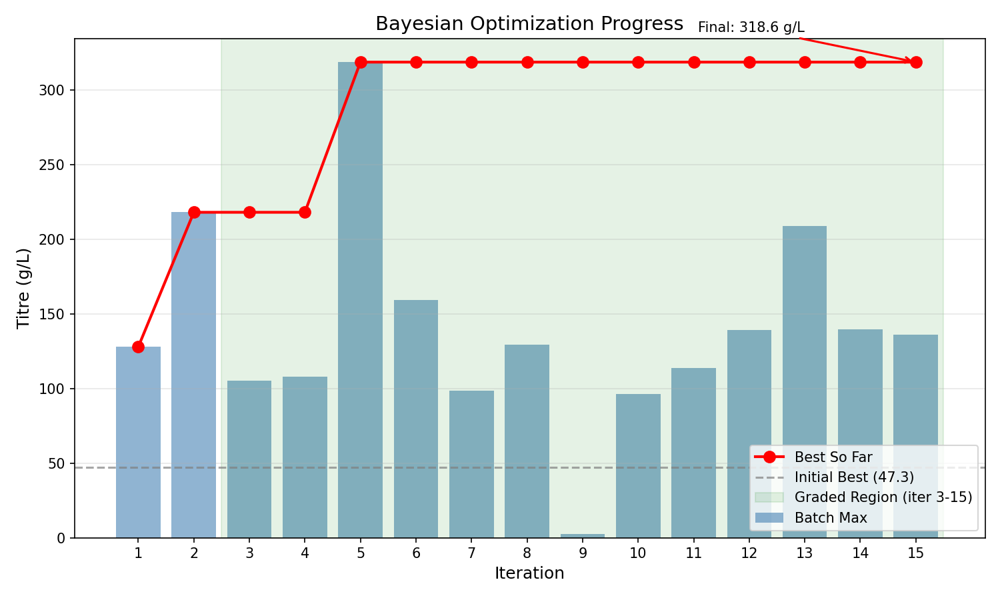
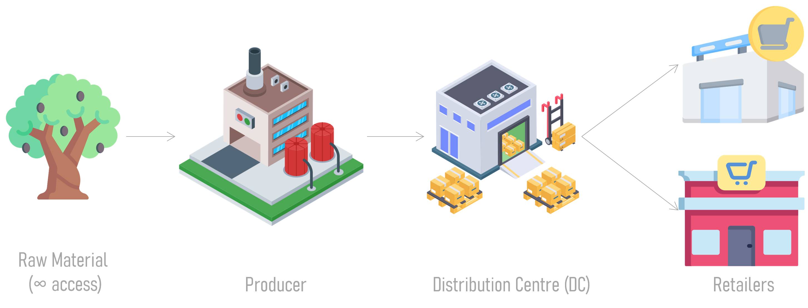
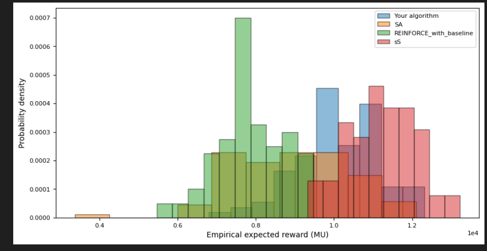

# ML for Chemical Engineering — Imperial College London


> Two ranked-submission coursework projects from Imperial's
> **Machine Learning for Chemical Engineering (ML4CE)** module:
> a **Batch Bayesian Optimiser** for bioreactor titre maximisation,
> and a **Multi-Restart Simulated Annealer** for inventory policy learning.
> Both algorithms were evaluated on held-out environments by the course's
> blind grading platform.

## Results at a glance

| Project | Metric | Our submission | Benchmark(s) |
|---|---|---|---|
| Batch BO | Best titre (g/L) | **318.6** | <!-- TODO: add baseline / top team --> — |
| RL / SA  | Mean episode reward | **≈10,100** | REINFORCE w/ baseline ≈7,800 · vanilla SA ≈8,900 · (s,S) oracle ≈11,200 |

---

## Project 1 — Batch Bayesian Optimization for Bioreactor Titre

**Problem.** Tune five continuous bioreactor inputs (temperature, pH, three feed
rates) and one categorical input (cell type) to maximise product titre.
Tight budget: 6 initial samples + 15 batches of 5 + **60 s** wall-clock per run.

**Approach.**
- Mixed-input Gaussian Process: RBF on continuous dims × multiplicative kernel on cell type
- UCB acquisition with adaptive β (3.5 → 1.3) and adaptive length scales
- Greedy batch construction with spatial repulsion + cell-type diversity bonus
- Sobol candidates globally; cross-cell-type local search around the running best

**Key idea — *cross-cell-type local sampling*.** When refining around the best
point, 30 % of local candidates use the *other* cell types. This catches cases
where a different cell type would actually win at similar conditions — something
a naive local search would miss entirely, and the move that gave us the largest
single jump in performance during development.



→ [`bayesian-optimization/`](bayesian-optimization/) — code and full report.

---

## Project 2 — Multi-Restart Simulated Annealing for Inventory Management



*Three-echelon supply chain (factory → distribution centre → retailers) under
stochastic Poisson demand. Diagram from the
[ML4CE course materials](https://github.com/OptiMaL-PSE-Lab/Imperial-ML4CE-Course).*

**Problem.** Learn an ordering policy across a three-echelon supply chain with
lead-time delays and stochastic demand. Budget per run: 5000 episodes, 5 min
wall-clock.

**Approach.**
- Direct, derivative-free optimisation of policy-network weights (~500 params)
- Gaussian perturbation + Metropolis acceptance with cooling temperature
- 10 independent SA restarts; explore probability decays from 0.8 → 0.2
- Mean over 5 episodes per fitness evaluation to suppress demand variance

**Key idea — *restart with explore→exploit scheduling*.** Single SA runs
plateaued around reward 7000. Independent restarts that progressively shift from
random Xavier initialisation to small perturbations of the running best lifted
the mean above 10,000 — a bigger gain than any single hyperparameter we tuned.



→ [`reinforcement-learning/`](reinforcement-learning/) — code and full report.

---

## Repository layout

```
.
├── bayesian-optimization/
│   ├── batch_bayesian_optimization.py   # GP + UCB + batch selection
│   ├── report.pdf                       # 2-page methodology writeup
│   └── figures/optimization_progress.png
└── reinforcement-learning/
    ├── simulated_annealing_policy_opt.py  # multi-restart SA over NN weights
    ├── report.pdf                         # 2-page methodology writeup
    └── figures/{SCstructure,performance_comparison}.png
```

## Reproducing the results

The code depends on the course-provided environment, simulator, and policy
network architecture, which are **not redistributed** here.

```bash
# Clone the course repo
git clone https://github.com/OptiMaL-PSE-Lab/Imperial-ML4CE-Course
cd Imperial-ML4CE-Course

# Set up the conda environments (one per project)
conda env create -f BatchBayesianOptimization/ml4ce_bo.yml
conda env create -f ReinforcementLearning/ml4ce_rl.yml
```

Then drop the cleaned algorithm files into the slots the course notebooks expect:

| Course slot | File from this repo |
|---|---|
| `BatchBayesianOptimization/algorithms/your_algorithm.py` | [`bayesian-optimization/batch_bayesian_optimization.py`](bayesian-optimization/batch_bayesian_optimization.py) |
| `ReinforcementLearning/algorithms/your_algorithm.py` | [`reinforcement-learning/simulated_annealing_policy_opt.py`](reinforcement-learning/simulated_annealing_policy_opt.py) |

Run the course notebooks (`MLCE_Coursework2025_BatchBO.ipynb`,
`ML4CE_RL_INV_CW.ipynb`) to reproduce the results.

## Authors

Joint coursework by:

- **Jakob Elias Hammerschmidt** — RWTH Aachen (exchange semester at Imperial)
- **Marc Al Hachem** — Imperial College London
- **Seif Ahmed Moheb Elmehelmy** — Imperial College London

All members contributed across both projects.

## Acknowledgments

Imperial College London — OptiMaL-PSE Lab — ML4CE 2024/25.
Course materials, simulators, and benchmarking infrastructure from
[OptiMaL-PSE-Lab/Imperial-ML4CE-Course](https://github.com/OptiMaL-PSE-Lab/Imperial-ML4CE-Course).

## License

Code: [MIT](LICENSE). Reports and figures: © the authors.
